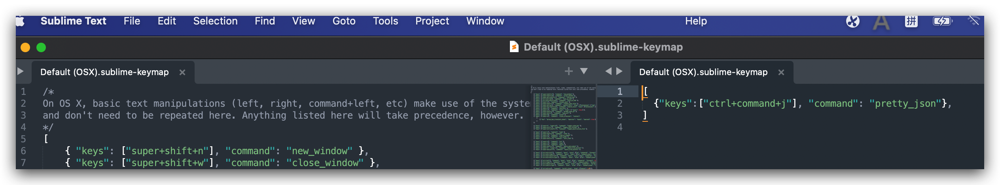

### 首先，安装插件管理器-Package control

方法一：按Command+Shift+p打开命令搜索框，输入PC，点击条目安装：


安装完成后，重启Sublime Text 3。如果在Perferences->package settings中看到package control这一项，则安装成功。

### 安装pretty json

cmd + shift +p，输入install package，打开包管理器。
加载完成后，在加载好的窗口上输入pretty json

## 配置快捷键

配置方式：Preference -> Key Bindings



打开后，在右侧输入配置即可，如果没生效就重启下。

```bash
[
  {"keys":["ctrl+command+j"], "command": "pretty_json"},
]
```

## 压缩json

打开查找\替换窗口
快捷键：`option + command +F`

批量替换 \s \t \n。

## 格式化json

现将json压缩为无空格和换行符的形式，然后按下快捷键，即可实现`格式化`。

格式化快捷键 :

macOS: `command` + `ctrl` + `j`
Windows: `ctrl` + `alt` + `j`